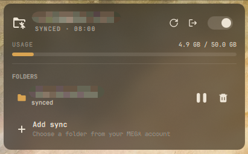

# Omaga Sync

[](LICENSE)
[](https://github.com/basecamp/omarchy)
[](https://github.com/meganz/MEGAcmd)

> **Tags / Topics:** `omarchy`, `quickshell`, `megasync`, `mega`, `hyprland`, `wayland`, `cloud-sync`, `statusbar-widget`, `systemd`

[English](README.md) | [Bahasa Indonesia](README_ID.md)

---

<p align="center">
  
</p>

---

**Omaga Sync** adalah integrasi sinkronisasi dua arah resmi [MEGAcmd](https://github.com/meganz/MEGAcmd) untuk desktop environment **Omarchy** (Quickshell / Wayland / Hyprland). Dirancang sebagai pengganti headless yang ringan, andal, dan bebas bug rendering tampilan desktop app bawaan di Wayland.

## Arsitektur

```text
mega-cmd-server ── systemd (omaga-sync-engine.service)     Mesin sync resmi MEGAcmd
      │ Socket lokal
omaga-sync monitor ── systemd (omaga-sync-monitor.service) Polling 5s → status.json
      │ File-watch                                              └─ notify-send saat error
Bar Widget (bisma.omaga-sync) ── Panel QML + kontrol interaktif (Jeda, Lanjut, Tambah, Hapus, Logout)
```

## Fitur Utama

- **Indikator Bar Status Dinamis:**
  - Status tersinkronisasi, berdenyut lembut saat aktif syncing, redup saat dijeda, dan menyala merah saat terjadi kendala/error.
- **Panel Interaktif Lengkap:**
  - Informasi akun, visual bar kuota penyimpanan (digunakan vs total).
  - Daftar folder lokal ↔ remote beserta status real-time tiap folder.
  - Tombol **Jeda / Lanjutkan** global dan per-folder.
  - Tombol **Hapus Sinkronisasi** (aman, tidak menghapus file lokal maupun cloud).
  - Fitur **Pilih & Tambah Sinkronisasi** interaktif langsung dari daftar remote folder akun MEGA.
  - Manajemen sesi dengan tombol **Logout** & onboarding **Login**.
- **Dukungan Multibahasa (i18n):**
  - Bahasa Indonesia (`id`) & Bahasa Inggris (`en`) otomatis mengikuti locale sistem atau preferensi konfigurasi widget.
- **Notifikasi Desktop Ringan:**
  - Hanya memberi tahu saat login kedaluwarsa, mesin server mati, atau sinkronisasi folder error — bebas spam.
- **Auto Healing & Supervisi Systemd:**
  - Menjaga proses `mega-cmd-server` tetap di bawah pengawasan systemd user session.

## Instalasi

### 1. Prasyarat: Pasang MEGAcmd
```bash
omarchy pkg aur add megacmd
```

### 2. Pasang Plugin & Service
Jalankan skrip instalasi untuk memasang plugin QML, binary CLI, dan unit systemd:
```bash
git clone https://github.com/bismawy/omaga-sync.git
cd omaga-sync
./install.sh
```

### 3. Login Akun MEGA (Sekali Saja)
```bash
mega-login email-anda
```
*(Atau klik tombol Login langsung dari panel widget bar untuk membuka terminal interaktif).*

## Perintah CLI (`omaga-sync`)

Utilitas `omaga-sync` dapat dipanggil langsung dari terminal untuk otomatisasi maupun skrip:

| Perintah | Deskripsi |
|---|---|
| `omaga-sync status` | Menampilkan status JSON terbaru dari monitor |
| `omaga-sync pause [folder]` | Menjeda sinkronisasi satu folder atau seluruh folder |
| `omaga-sync resume [folder]` | Melanjutkan sinkronisasi satu folder atau seluruh folder |
| `omaga-sync add <folder-mega> [dasar]` | Menghubungkan folder MEGA ke direktori lokal (default `~/MEGA`) |
| `omaga-sync remove <folder-lokal>` | Menghapus pasangan sync (file di kedua sisi tetap aman) |
| `omaga-sync logout` | Keluar dari sesi akun MEGA aktif |
| `omaga-sync login [email]` | Membuka helper terminal login interaktif |
| `omaga-sync open <folder>` | Membuka folder lokal dengan `xdg-open` |
| `omaga-sync repair` | Mematikan instance server tak terawasi dan me-restart via systemd |

## Pengembangan & Hot Reload

Untuk memperbarui file QML / JS tanpa menyentuh service daemon:
```bash
./install.sh --plugin-only
```

Validasi plugin:
```bash
omarchy plugin validate ~/.config/omarchy/plugins/bisma.omaga-sync
```

## Lisensi

[MIT License](LICENSE) © 2026 Bisma
