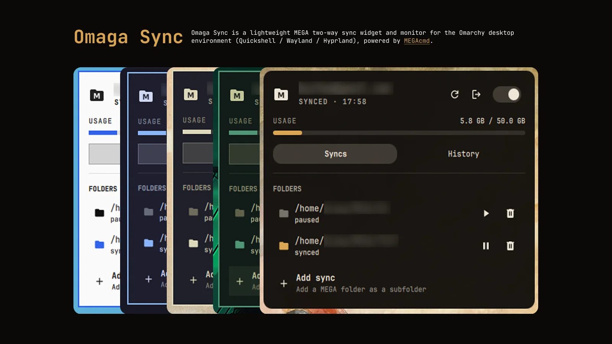

# ⚡ Omaga Sync

**Widget bar, daemon monitor, dan integrator emblem GNOME Files / Nautilus untuk sinkronisasi dua arah MEGA di [Omarchy](https://github.com/basecamp/omarchy) (Quickshell / Wayland / Hyprland).**

Ditenagai langsung oleh mesin headless [`mega-cmd-server`](https://github.com/meganz/MEGAcmd)—dirancang sebagai alternatif Wayland yang ringan, andal, dan bebas glitch visual aplikasi desktop resmi MEGAsync.

[](https://github.com/basecamp/omarchy)
[](https://github.com/meganz/MEGAcmd)
[](./LICENSE)
[](./manifest.json)

[English](README.md) | [Bahasa Indonesia](README_ID.md)

---

<p align="center">
  
</p>

---

## ⚡ Arsitektur

```text
mega-cmd-server ── systemd (omaga-sync-engine.service)     Daemon sinkronisasi headless MEGAcmd
      │ Socket UNIX lokal
omaga-sync monitor ── systemd (omaga-sync-monitor.service) Polling 5s → status.json (bounded reader)
      ├── Integrator GNOME Files / Nautilus                └─ In-process Gio metadata::emblems
      └── Dispatcher Notifikasi Desktop                    └─ notify-send saat error/kendala
Bar Widget (bisma.omaga-sync) ── Panel Quickshell QML      ├─ Kuota penyimpanan, progres transfer
                                                           ├─ Jeda / Lanjut / Tambah / Hapus pair
                                                           └─ Picker & pembuat folder cloud interaktif
```

---

## 🚀 Fitur Utama

- 📊 **Indikator Bar Status Dinamis:**
  - Ikon status tersinkronisasi real-time, denyut lembut saat transfer data aktif, ikon redup saat dijeda, dan indikator merah tegas saat terjadi kendala sync atau engine mati.
- 📂 **Panel Interaktif Lengkap:**
  - Visual kuota penyimpanan akun (digunakan vs total kuota).
  - Daftar pasangan folder lokal ↔ remote beserta status sync individual.
  - Kontrol **Jeda / Lanjutkan** global dan per-folder.
  - Tombol **Hapus Sinkronisasi** (aman; file di lokal dan cloud tetap utuh).
  - **Picker & Pembuat Folder Cloud Interaktif**: telusuri folder remote MEGA atau buat direktori cloud baru langsung dari antarmuka tanpa terminal.
  - Manajemen sesi terintegrasi dengan tombol **Logout** dan onboarding terminal **Login**.
- 🏷️ **Emblem Status di Nautilus / GNOME Files:**
  - Badge sudut status pada folder dan file via `metadata::emblems` (`emblem-omaga-synced`, `emblem-omaga-syncing`, `emblem-omaga-error`, dan `emblem-omaga-transfer`).
  - Integrasi performa tinggi in-process `Gio` dengan penulisan berbasis diff, rate-budget chunking, dan pembersihan otomatis saat monitor dihentikan/dihapus.
- 🌐 **Dukungan Multibahasa (i18n):**
  - Bahasa Indonesia (`id`) & Bahasa Inggris (`en`) lengkap dengan deteksi locale sistem otomatis atau preferensi pengaturan widget.
- 🔔 **Notifikasi Desktop Relevan & Bebas Spam:**
  - Hanya dikirimkan saat memerlukan tindakan pengguna (sesi kedaluwarsa, engine mati, atau kendala sinkronisasi).
- 🛡️ **Supervisi Systemd & Auto-Healing:**
  - Mengawasi `mega-cmd-server` di bawah user session systemd dengan perbaikan otomatis terhadap instance server tak terawasi.

---

## 📦 Instalasi & Pengaturan

### 1. Prasyarat: Pasang MEGAcmd
```bash
omarchy pkg aur add megacmd
```

### 2. Pasang Plugin & Service
Kloning repositori dan jalankan skrip instalasi:
```bash
git clone https://github.com/bismawy/omaga-sync.git
cd omaga-sync
./install.sh
```

### 3. Login Akun MEGA (Sekali Saja)
```bash
mega-login email-anda@example.com
```
*(Atau klik tombol **Login** langsung dari panel widget bar untuk membuka helper terminal interaktif).*

---

## 🛠️ Perintah CLI (`omaga-sync`)

Utilitas `omaga-sync` dapat dipanggil langsung dari terminal untuk otomatisasi maupun skrip:

| Perintah | Deskripsi |
|---|---|
| `omaga-sync status` | Menampilkan status JSON terbaru dari daemon monitor |
| `omaga-sync pause [folder]` | Menjeda sinkronisasi satu folder atau seluruh pasangan aktif |
| `omaga-sync resume [folder]` | Melanjutkan sinkronisasi satu folder atau seluruh pasangan aktif |
| `omaga-sync add <folder-mega> [dasar]` | Menghubungkan folder MEGA ke direktori lokal (default `~/MEGA`) |
| `omaga-sync remove <folder-lokal>` | Menghapus pasangan sync secara aman (file lokal & cloud tetap utuh) |
| `omaga-sync logout` | Keluar dari sesi akun MEGA aktif |
| `omaga-sync login [email]` | Membuka helper login interaktif di terminal |
| `omaga-sync open <folder>` | Membuka folder lokal dengan manajer berkas bawaan (`xdg-open`) |
| `omaga-sync repair` | Mematikan instance server tak terawasi dan me-restart via systemd |

---

## 🔧 Pengembangan & Hot Reload

Untuk memperbarui file QML / JS tanpa me-restart service daemon:
```bash
./install.sh --plugin-only
```

Validasi plugin:
```bash
omarchy plugin validate ~/.config/omarchy/plugins/bisma.omaga-sync
```

---

## 📜 Lisensi

Didistribusikan di bawah **[MIT License](LICENSE)** © 2026 Bisma.
